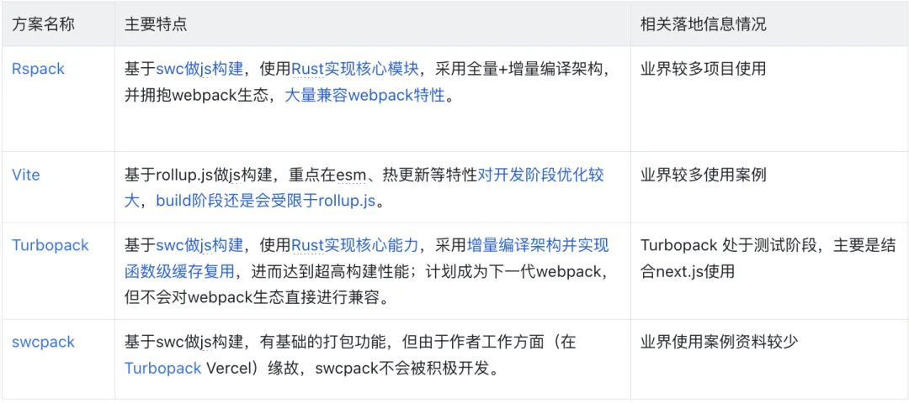
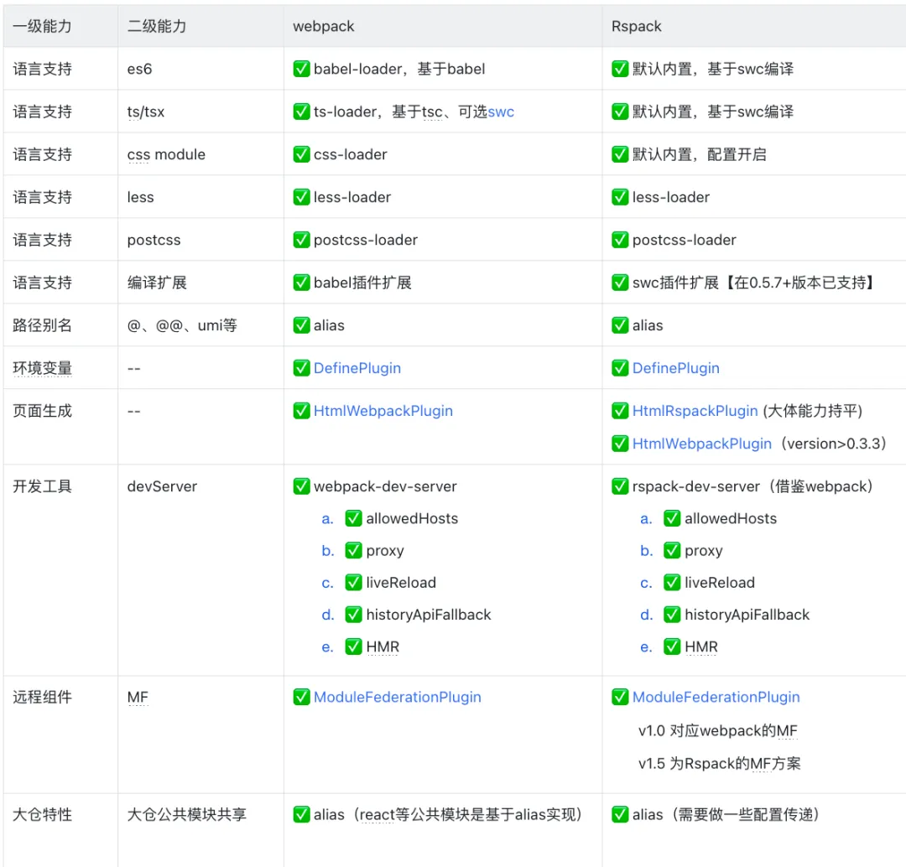
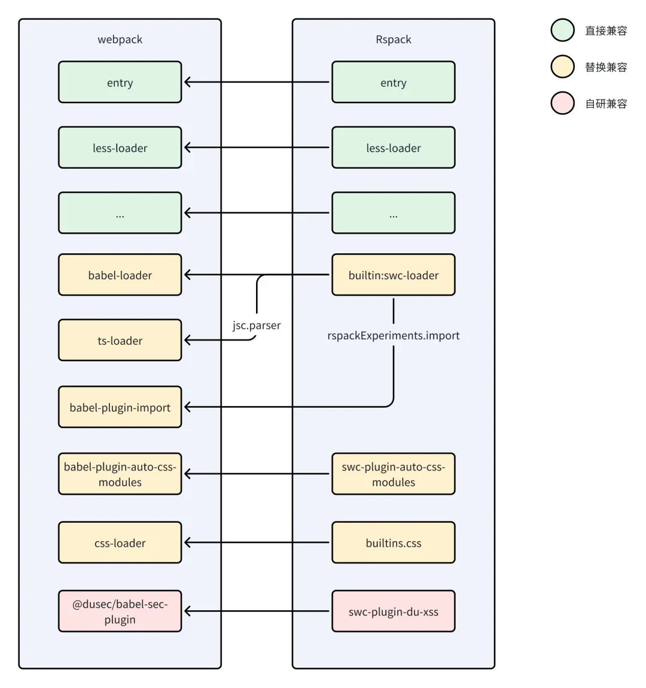
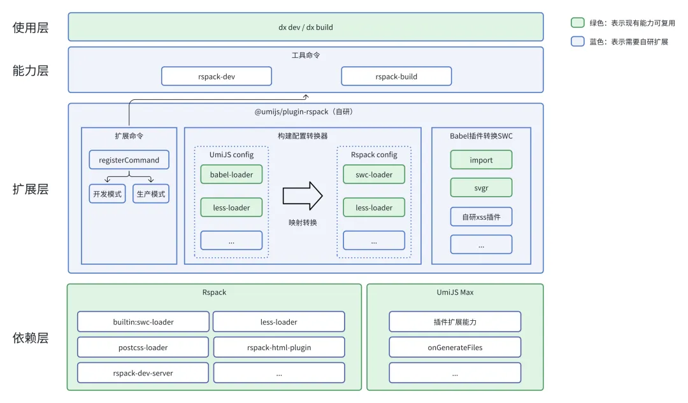
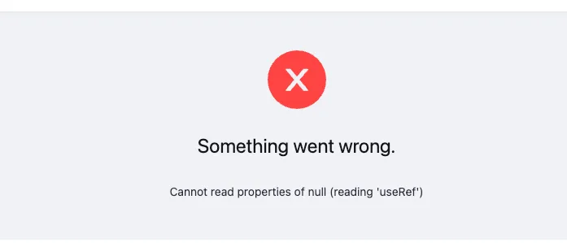
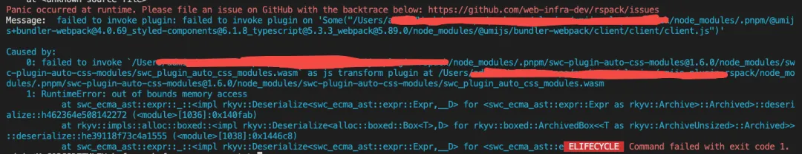
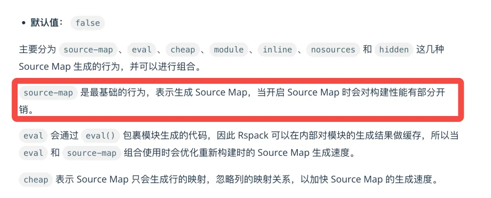
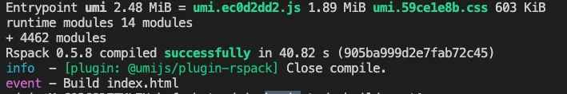
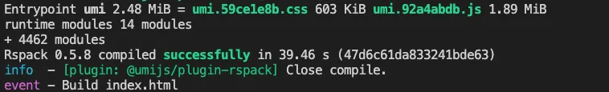
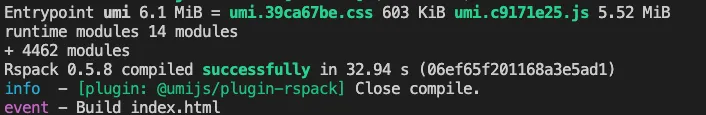

# 基于Rspack实现大仓应用构建提效实践

<!-- 文章样式定义 -->
<!-- 
<style>
/* 首行缩进两个空格 */
p {
  text-indent: 2em;
}
</style>
-->


## 一、实践背景

随着项目的逐步迭代，代码量和依赖的逐渐增长，应用的构建速度逐步进入缓慢期。以目前所在团队的业务应用来看（使用webpack构建），应用整体构建耗时已经普遍偏高，影响日常开发测试的使用效率，其中编译耗时大约占50%。

实际上随着近些年前端的技术发展以及业务对前端交互体验的要求提高，前端整个代码量复杂度和代码量增长飞快。随着这一趋势的变化，服务于前端工程构建方案多年的webpack，在构建效率上已经逐渐成为瓶颈。因此业界也存在不少优化思路和方案，主要分两个方向：

基于原有Node.js语言实现，通过缓存等方案来提升构建效率，主要是缓存、预构建的方式来减少编译。此类方案多数存在条件限制，比如缓存方案前提是第一次先生成缓存来提升二次构建效率，对于发布平台等需要冷启场景无法生效。
另外一类是采用Golang、Rust等语言重新实现耗时较为复杂的编译过程，从语言层面实现编译过程的性能提升。比较有代表的有，基于Golang实现的esbuild、基于Rust实现的SWC，都在对应的场景得到不少的性能提升。

## 二、业界方案
既然是业界的普遍性问题，那么外界也肯定会存在不少优化案例可以借鉴或者复用。由于Node.js的优化方案通常都会存在各种场景限制，这里我们主要从另外一个思路去寻找方案。经过调研目前业界的主要方案有Rspack、Vite、Turbopack、swcpack相对比较有代表性（可能还有其他方案，由于笔者时间精力有限未能了解到）。几个方案主要的情况如下（笔者个人主观分析，仅供参考）：



## 三、技术选型
先看当前大仓前端应用主要技术体系：整体技术栈主要是React为主，未来Vue还会逐步迁移React；框架层面UmiJS@4大概占60%、UmiJS@v3大概占20%、剩余为其他Vue或者C端的多页应用。整体技术体系主要是UmiJS为主，配套主要是webpack的构建方案，部分Vue项目有使用Vite。

在这样的现实情况下，我们面对的主要是React+UmiJS+webpack的应用。基于应用广泛性考虑，只要解决这部分应用就可以达到80%的应用提速覆盖。为此，我们选择了基于Rspack来实现构建方案的性能提升，主要考虑有以下几点：

高性能：基于Rust实现核心能力，全量编译+增量编译（HMR）的实现方式，官方宣称实际落地有5~10倍的提升，随着未来逐步优化完善还有提升空间，且生产和开发阶段除缓存之外，基本可以获得一致性的性能收益。
低成本：Rspack大量兼容webpack生态，大量配置和插件可以直接或者调整一下配置即可复用，仅需对一些特殊的插件自研定制开发即可。以下是对项目主要使用到的webpack能力进行了梳理，并对其在Rspack中的情况情况也进行了对照。



综合情况来看：虽然性能Rspack未必是最高的，但其兼容webpack生态带来的低成本迁移，是其他的方案基本上无法做到的。对此，选择了基于Rspack来作为基础的底层能力。得益于此，我们最终实现了业务代码零改动即可实现构建方案迁移（仅微调构建配置），并获得云构建2倍+编译性能的提升。

## 四、方案设计思路
由于大仓目前大量的应用为UmiJS@4体系，作为我们主要服务的目标对象，本文也是主要先针对解决UmiJS@4版本的应用方案。

### 方案难点
* UmiJS仅支持webpack和Vite两种构建模式，如何扩展Rspack构建？
* 业务应用中有大量使用UmiJS插件、Babel插件来实现一些特殊能力，如何支持此类插件的能力？
* 如何尽可能降低业务应用接入成本，进而达成方案快速应用到各个业务应用中？

### 通过扩展插件命令实现Rspack构建
UmiJS默认构建能力是封装在@umi/max内部，通过max dev/build来调用内置配套的本地/生产构建。在UmiJS官方上并未提供编译能力的完全自定义扩展能力，仅支持Vite/webpack的选择以及提供了一些修改构建配置的方法。

通过查看UmiJS项目的源码，发现其内部的构建实现全部集中在dev/build这两个扩展命令中。源代码在preset-umi/src/commands/目录下的dev/dev.ts和build.ts 两个文件，分别对应dev和build命令。而实际上的构建逻辑，实现上主要是在 @umijs/bundler-vite 和 @umijs/bundler-webpack两个包中。其内部执行的主要逻辑如下（这里以dev模式为例，build模式基本上类似，就是少了文件监听编译和express相关逻辑）：


那么我们只需要在新的命令中实现相关的逻辑，即可通过扩展命令的方式来扩展Rspack构建能力。另外，使用该方法实现，还能沿用UmiJS原本的代码生成等原本的插件，进而可以避免需要大量重新实现UmiJS插件的能力，并降低重写带来的逻辑不一致风险。

### 官方平替插件+少部分自研扩展支持原有插件能力
前面的插件扩展模式已经能保证原有大量的UmiJS能力是可以直接沿用的，比如生成路由、添加tailwind.css等UmiJS内置能力都可直接沿用。另外项目主要依赖扩展的插件，除了少部分修改构建能力的插件之外，基本上都可以直接使用或者少量适配即可。不兼容的几个插件主要是因为：功能是通过修改的webpack配置来调整构建能力，需要通过使用对应的Rspack构建能力来进行兼容。

另外除了UmiJS的插件之外，还有构建依赖的Babel插件部分，当然部分Babel插件也是通过UmiJS插件引入使用的。对此，也对主要的Babel插件的情况进行了梳理，其主要的情况如下表：


所以整体上还是以沿用webpack原有扩展加Rspack官方能力替换为主，只需要针对少部分未支持的Babel插件进行扩展即可实现。

### 基于配置映射实现业务超低接入成本
想要达成方案可以快速应用的理想效果，就是让应用接入过程中尽可能少改内容，特别是业务代码。因为一旦要改业务代码逻辑，这种就会增加非常多的接入成本，所以在方案设计上，构建能力以及原本UmiJS的相关配置能力要尽量去沿用并且满足基本上不需要业务侧同学去感知差异化的内容。

带着这个需求并结合前面的几块内容分析来看，大多数内容都是有平替方案，少部分需要进行自定义开发扩展，主要也是集中在Babel插件上。那么我们需要做的就是维持UmiJS转换生成webpack的配置逻辑不动，在拿到webpack配置之后，再对webpack的配置做解析通过一个配置转换器对需要转换成Rspack的内容进行转化，对原本兼容的配置直接迁移使用即可实现我们的目的。

### 配置&能力映射示意图：



### 方案架构
结合以上的问题解决思路以及目标，最终方案的架构设计如下：



### 架构要点说明：

通过扩展自研插件，提供自定义的rspack-dev和rspack-build命令来提供开发、生产模式，接入时仅需要安装插件并替换启动命令即可（举个例子：package.json中修改max dev为max rspack-dev）。
通过插件内部对配置进行转化，将原本UmiJS的配置转为Rspack配置，保障业务应用接入时基本不感知。另外在开发成本方面，由于大多数loader和plugin可以复用，主要是配置和loader等能力替换映射成本。
方案基于UmiJS的max扩展，原本UmiJS的扩展能力不受影响。业务高使用率Babel插件有现成的SWC扩展能力可直接替换（比如：Babel-plugin-import、svgr等），少部分自研插件需要使用Rust重写。
### 稳定性保障
切换构建之后，less/postcss插件是一致的，主要风险来自于两个方面：

- webpack转Rspack：Rspack项目内平移了大量的webpack测试用例用于保障一致性，另外默认严格模式，出现不兼容配置会抛出错误中断构建，保证了基础方面的稳定性。


- Babel（v7）转SWC：SWC支持所有stage 3 perposals 、preset-env，JS/TS语法编译能力上跟Babel 7对齐。在插件生态上不一致，若有使用Babel插件，需要考虑替换方案（详情参考附录中的Babel插件使用情况）。


虽然在Rspack方面申明已经兼容了主流的内容，但毕竟是替换了构建方案，对业务来说还是存在一些未知的风险，还是需要一些手段来进行保障业务应用的稳定性。

### 稳定性保障手段：

- 构建报错中断策略：配置上出现不支持的Babel插件直接报错中断构建，避免未支持的内容被跳过进而导致异常发布上线。
- 阶段推进落地策略：由于大多数构建运行都是在开发测试阶段（粗略统计平台发布70%左右为测试环境），先行接入开发&测试环境达到构建效率提升，等开发测试阶段跑稳定之后，再从非核心应用开始试点上线，功能稳定之后再逐步推广。
- 极简的应急恢复策略：由于极低的接入成本，若接入遇到问题想快速回退也非常简单，仅需回退命令为dev/build即可完成应急恢复。

## 五、方案效益

**实现超低接入成本：** 仅需改动三个小步骤，一两分钟即可完成接入。具体步骤如下：

- 添加并安装依赖：添加并安装@umijs/plugin-rspack依赖（得物私有npm包）。

```
dx add @umijs/plugin-rspack@latest -D
添加UmiJS的plugin：在config/config.ts中修改plugins属性。
{
    // 原有其他配置
    ...
    plugins: [
        // 原有其他插件
        ..., 
        // 添加 @umijs/plugin-rspack 插件
        '@umijs/plugin-rspack',
    ],
    // 原有其他配置
    ...
}
```
- 修改构建命令：修改package.json中的构建命令，将对应环境的命令调整为
rspack-dev/rspack-build，并增加NODE_ENV配置。
```
{
    "scripts": {
        // start 对应支持本地的dx dev，
        // 原配置样例
        - "start": "cross-env BUILD_ENV=dev max dev",
        // 改rspack构建样例
        + "start": "cross-env BUILD_ENV=dev NODE_ENV=development max rspack-dev",
        // pnpm:build:x 对应支持发布平台指定的环境
        // 原t1配置样例
        - "pnpm:build:t1": "cross-env BUILD_ENV=t1 max build",
        // t1改rspack构建样例
        + "pnpm:build:t1": "cross-env BUILD_ENV=t1 NODE_ENV=production max rspack-build",
        ... // 原先的其他配置，酌情进行调整
    }
}
```
**平均2倍+的编译性能提升：** 大仓应用接入17个应用（目前主要是接入开发、测试环境），平均提升在2倍以上。以自身负责的一个应用为例，原有webpack编译耗时150秒，接入后降低到40秒（减少73.33%），加上优化过程中去除部分无用的引入代码最终仅需20秒左右。

## 六、分享过程中的一些干货
这里主要结合UmiJS所需要的能力，分享一些UmiJS涉及到的Rspack用法以及过程中一些比较典型的内容。

### 支持ts/tsx
ts/tsx的支持主要依靠的是swc-loader，Rspack使用了Rust定制的builtin:swc-loader，其使用方式基本上是跟webpack的swc-loader一致的，详情可以直接参考swc-loader文档，这里主要体现一些常用的配置项，具体使用可以结合自身项目情况来调整。
```
export default {
  module: {
    rules: [
      {
        test: /\.(j|t)s(x)?$/,
        loader: 'builtin:swc-loader',
        options: {
          env: {
            // 浏览器兼容性，支持browserslist，详细可以参考：https://swc.rs/docs/configuration/supported-browsers#targets
            targets: {
              chrome: "80",
            },
          },
          // js/ts编译配置
          jsc: {
            parser: {
              // 开启ts编译
              syntax: 'typescript',
              // 开启tsx编译
              tsx: true,
              // 开启@装饰器编译
              decorators: true,
              // 动态import
              // dynamicImport: false,
            },
            transform: {
              // react运行环境配置
              react: {
                // dev模式打开development启动react的开发模式
                development: isDev,
              },
              // stage 1 的旧版本class decorators
              legacyDecorator: true,
              // 支持 ts emitDecoratorMetadata
              decoratorMetadata: true,
            },
          },
        },
      },
    ]
  }
}
```
### React HMR
在看文档配置时，感觉不好理解，实际使用上其实分两种情况：

- 直接使用Rspack的devServer情况下，需要同时开启devServer.hot和@rspack/plugin-react-refresh。如下配置：
```
import ReactRefreshPlugin from '@rspack/plugin-react-refresh';

export default {
    ... 其他配置
    devServer: {
        // 开启HMR，官方文档也有体现
        hot: true,
    },
    plugins: [
        ...其他插件
        // React热更新支持插件
        isDev && new ReactRefreshPlugin(),
    ]
}
```
- 若不使用devServer的情况下，需要用rspack.HotModuleReplacementPlugin来实现devServer.hot的能力。由于这种方式未在实践过程中进应用，这里不进行具体的使用举例。
- 
### Module Federation
Rspack提供了两个版本的模块联邦能力，官方文档主要是介绍的v1.5对应的是经过Rspack改良过的版本。但实际上在一些情况下，如果直接跟webpack的MF对接会存在一些问题。我们在第一次使用过程中，也是对接了默认的v1.5版本，就出现了公共依赖无法找到的问题，错误提示如下：



实际上若需要跟webpack项目对接的情况下，需要采用v1.0版本的MF插件，使用方法如下：
```
import { container } from '@rspack/core';
export default {
    ... 其他配置
    plugins: [
        new container.ModuleFederationPluginV1({
            ... 这里是mf的配置
        })
    ]
}
```
### 样式按需引入：babel-plugin-import
babel-plugin-import作用：主要是配合ant-design或poizon-design（基于antd定制主题）库来使用，通过插件识别js中依赖的组件，自动注入样式文件，进而实现css的按需引用。实现类似如下效果：
```
// 手写源代码
import { Button, Input } from 'antd';

// 通过插件编译后
import { Button, Input } from 'antd';
import 'antd/lib/button/style';
import 'antd/lib/input/style';
```
在Rspack中使用的是swc来进行js/ts解析的，故babel-plugin-import是不能直接使用的，需要采用builtin:swc-loader的rspackExperiments来进行对应的能力支持。其配置方法如下：
```
export default {
  module: {
    rules: [
      {
        test: /\.(j|t)s(x)?$/,
        loader: 'builtin:swc-loader',
        options: {
          experimental: {
            // babel-plugin-import的配置
            import: [
              // pd按需注入样式
              { libraryName: 'poizon-design', libraryDirectory: 'es', style: true },
              // antd按需注入样式
              { libraryName: 'antd', libraryDirectory: 'es', style: true },
            ],
          }
        }
      }
    ]
  }
}
```
### cssModules：auto-css-modules
在UmiJS中，默认是通过auto-css-modules来进行css-modules代码的判断；其原理为通过ast语法树，判断import引入样式文件时，若有声明对应的变量，就将其打上一个query标记。并在样式文件处理时，通过resourceQuery来进行匹配对应的文件，并添加css-modules的编译能力。详情见：UmiJS AutoCssModules插件源代码、UmiJS CSS编译配置源代码。

通过UmiJS项目以及结合一些资料，Babel的auto-css-modules能力有swc-plugin-auto-css-modules可以替代，配置的话，主要几个关键点：

- 添加swc-plugin-auto-css-modules插件（实际上开源的插件并不能用，后文详细说明原因）。
- 添加builtins.css配置，指定cssModules编译时的方式，主要有样式名是否保持，输出的样式格式。
- 加resourceQuery识别，并给对应的内容加type: ‘css/module’；Rspack默认会对type: 'css/module’的代码当做cssModules编译，这个用法会比使用css-loader+style-loader更方便。
具体配置实现参考如下：
```
const postcssLoader = {
  loader: require.resolve('postcss-loader'),
  options: {
    // ...此处省略less-loader配置
  }
};

const lessLoader = {
  loader: require.resolve('less-loader'),
  options: {
    // ...此处省略less-loader配置
  }
}

export default {
  builtins: {
    css: {
      // cssModule默认配置
      modules: {
        // class保持原样输出
        localsConvention: 'asIs',
        // class转换后的格式，localIdentName跟css-loader并不完全兼容，比如[hash:base64:5]这种写法就会报错
        localIdentName: '[local]_[hash:8]',
      },
    },
  },
  module: {
    rules: [
      {
        test: /\.(j|t)s(x)?$/,
        loader: 'builtin:swc-loader',
        options: {
          experimental: {
            plugins: [
              // ...此处其他配置内容
              // 添加 swc-plugin-auto-css-modules 插件执行?modules的注入
              [require.resolve('swc-plugin-auto-css-modules'), {}]
            ]
          }
        },
      },
      {
        test: /\.css(\?.*)?$/,
        oneOf: [
          {
            // 通过resourceQuery来匹配?modules
            resourceQuery: /modules/,
            use: [postcssLoader],
            // type声明指定为cssModules解析
            type: 'css/module'
          },
          {
            use: [postcssLoader],
            // type声明指定为普通css解析
            type: 'css'
          },
        ]
      },
      {
        test: /\.less(\?.*)?$/,
        oneOf: [
          {
            resourceQuery: /modules/,
            use: [postcssLoader, lessLoader],
            type: 'css/module'
          },
          {
            use: [postcssLoader, lessLoader],
            type: 'css'
          },
        ]
      },
    ]
  }
}
```
但实际上上述的配置并不能直接跑起来，运行时会提示构建报错（RuntimeError: out of bounds memory accesSS），错误如下图：



结合github上的相关issue最终定位为swc_core版本不兼容的问题导致。

原因详解：

- Rspack使用的swc_core为0.88.x0.89.x对应@swc/core为@swc/core@1.3.106@swc/core@1.3.107(swc官网可见)。
- swc-plugin-auto-css-modules的@1.6.0虽然在文档上写着是兼容>= 1.3.106版本，但实际上由于其内部使用了swc_core@0.90.13（详见Github源码）。
- 但swc在0.90.x进行了ast的重构，跟之前的版本有了较大出入，导致无法生成的wasm调用无法兼容。

**问题解决办法：** 实际上只要通过将swc-plugin-auto-css-modules的swc_core版本修改为0.88.x~0.89.x这个范围内，再编译出新的wasm文件即可解决；若有其他类似情况，也可以借鉴一下。

**具体操作步骤：**

- 将swc-plugin-auto-css-modules的swc_core修改版本后，在本地构建生成一个wasm文件，并放到项目内。
- swc的plugin修改为引入本地构建的wasm文件，其配置如下。
```
plugins: [
  // ...此处其他配置内容
  // 添加 swc-plugin-auto-css-modules 插件执行?modules的注入
  // 删掉原有的 swc-plugin-auto-css-modules 引入
  - [require.resolve('swc-plugin-auto-css-modules'), {}]
  // 修改为引入项目相对目录下的swc_plugin_auto_css_modules.wasm（因为开源的发版有发版周期，先进行自编译使用）
  + [path.join(__dirname, '../../swc-plugins/swc_plugin_auto_css_modules.wasm'), {}],
]
```
### 影响编译效率的devtool: “source-map”
在以往使用webpack的devtool时，也能感受到有一定的性能开销；同时在Rspack中，官方文档中也有说明当devtool开启并设置sourcemap时有性能开销。官方文档：



实际体验下来，source-map的模式损耗确实是大，大约会增加30%的耗时，而其他一些模式在构建损耗上会有所优化，具体可视使用情况来选择建议在开发测试环境不使用，仅在线上等需要的环境开启。相同应用和机器环境，不同devtool的几种测试表现如下：



devtool: source-map（40.82s）



devtool: cheap-module-source-map（39.46s）



devtool: eval（32.94s）


devtool: false (31.21s)

### 可能你不知道的低效代码
在前面的内容中有提到babel-plugin-import按需引入的利器，但在业务项目中也有发现，应用/组件中有直接引入…/dist/antd.less的情况。若在项目中有这种情况，实际上就是打包了多次antd的样式，非但没有作用反而让构建打包和应用访问性能更差。

以下为英特尔i5芯片差异情况（M2等芯片在耗时上会缩小一些）：

在css-moduels中（比如：大多数页面less、组件less）：每引入一次，大约增加6~7s左右构建时间，css文件大约增加660kb。

在非css-moduels中（比如：global.less）：每引入一次，大约增加4~5s构建时间，css文件大约增加530kb。

> 📢📢📢：建议平时项目中排查注意一下，可以将此类代码进行删除，一个小小的习惯就可以直接提升不小的构建和访问性能。

## 七、未来规划
整个项目过程下来，收获颇丰。一个是对前端构建以及Rust方面有了更多的认识，另外在接入过程中，也对当前的应用现状和技术体系由了更深入的了解。但当前项目主要服务于自身的业务的开发测试环境，使用范围还相对比较窄，还存在一些转换能力缺失的情况。未来将持续完善现有的构建转换能力，来拓展更多的业务应用场景。

## 八、特别说明
由于文章内的相关内容实践已经落地有了一段时间，文章内的一些内容可能已经发生了变化，若存在出入烦请以相应产品的官方介绍为准。比如：Rspack的新本部已经升级了swc_core到v0.91.x~v0.93.x兼容了swc-plugin-auto-css-modules的1.6.0版本，Turbopack计划未来全面支持webpack的相关工具特性等。

相关参考资料站点：

1. Rspack：https://www.rspack.dev/
2. UmiJS: https://umijs.org/
3. Webpack：https://webpack.js.org/
4. SWC：https://swc.rs/
5. Vite：https://cn.vitejs.dev/guide/
6. Turbopack：https://turbo.build/pack
