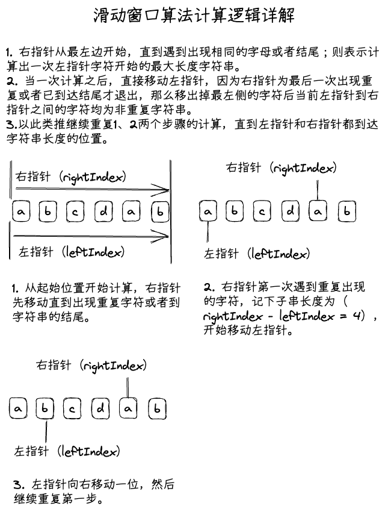
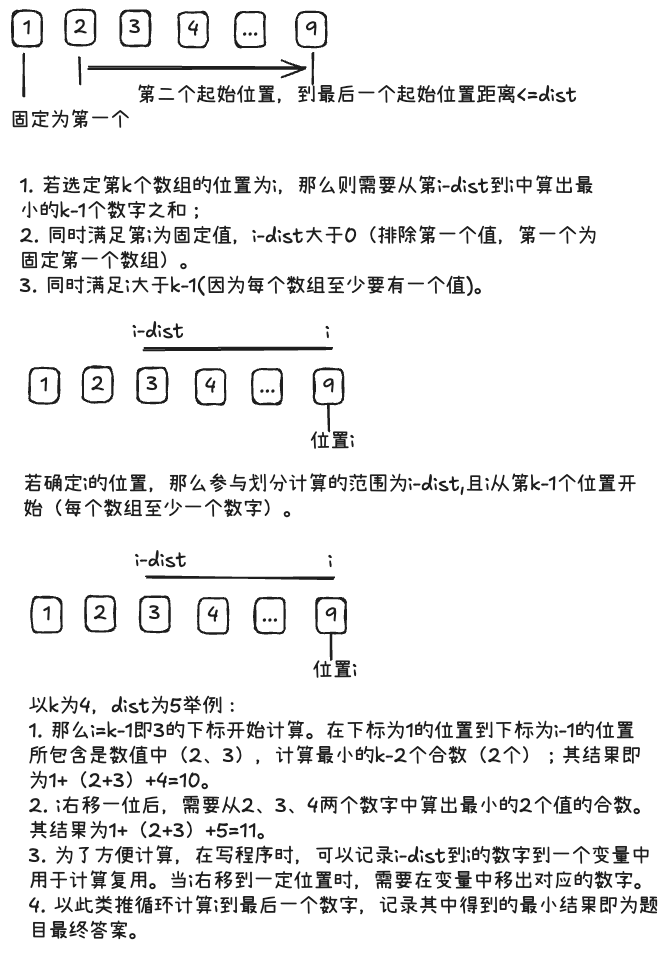

# LeetCode

## 1. 滑动窗口算法题

给定一个字符串s，请你找出其中不含有重复字符的最长子串的长度。

### 1.1 最原始解法

每一个字符开始都去寻找他的最长子串，并记录下最长的串。时间复杂度O(n²)

```JavaScript
/**
 * @param {string} s
 * @return {number}
 */
var lengthOfLongestSubstring = function(s) {
    const tempChares = new Set();
    let longestCount = 0;
    if (!s || s?.length <= 1) {
        return s?.length || longestCount;
    }
    let start = 0;
    while(start < s.length) {
        tempChares.add(s[start]);
        let end = start + 1;
        while(end < s.length) {
            const char = s[end];
            if (!tempChares.has(char)) {
                tempChares.add(char);
            } else {
                break;
            }
            end++;
        }
        const strLong = end - start;
        if (strLong > longestCount) {
            longestCount = strLong;
        }
        start++;
        tempChares.clear()
    }
    return longestCount;
};
```

### 1.2 官方答案，采用滑动窗口方法

```JavaScript
// 官方答案
var lengthOfLongestSubstring = function(s) {
    // 哈希集合，记录每个字符是否出现过
    const occ = new Set();
    const n = s.length;
    // 右指针，初始值为 -1，相当于我们在字符串的左边界的左侧，还没有开始移动
    let rk = -1, ans = 0;
    for (let i = 0; i < n; ++i) {
        if (i != 0) {
            // 左指针向右移动一格，移除一个字符
            occ.delete(s.charAt(i - 1));
        }
        while (rk + 1 < n && !occ.has(s.charAt(rk + 1))) {
            // 不断地移动右指针
            occ.add(s.charAt(rk + 1));
            ++rk;
        }
        // 第 i 到 rk 个字符是一个极长的无重复字符子串
        ans = Math.max(ans, rk - i + 1);
    }
    return ans;
};
```

### 1.3 理解后的优化结果

原理介绍：



```TypeScript
const lengthOfLongestSubstring = (s: string): number => {
    if (!s || s.length <= 1) {
        // 长度小于等于1时，无需计算，直接返回结果
        return s?.length || 0;
    }
    const tempSet: Set<string> = new Set();
    let rightIndex: number = 0;
    let longestCount: number = 0;
    for(let leftIndex = 0; leftIndex < s.length; leftIndex++) {
        if (leftIndex > 0) {
            tempSet.delete(s[leftIndex - 1]);
        }
        while(rightIndex < s.length && !tempSet.has(s[rightIndex])) {
            tempSet.add(s[rightIndex]);
            rightIndex++;
        }
        // 如果当前滑动窗口子串的长度为大于已记录的长度，则进行计算；用Math.max可以等于该效果。
        longestCount = Math.max(longestCount, rightIndex - leftIndex);
        if (rightIndex === s.length || s.length - leftIndex < longestCount) {
            // 1. 如果右指针已经到了最右边，则在此次之前计算得到的结果已经是最长的了，左边指针越往右边移动长度只会越短，没必要再进行计算。
            // 2. 如果左指针到最右侧的距离已经小于已知的最长子串，那么也不需要再计算。
            break;
        }
    }
    return longestCount;
}
```

## 2. 二分法查找

给你一个字符数组 letters，该数组按 非递减顺序 排序，以及一个字符 target。letters 里至少有两个不同的字符。
返回 letters 中大于 target 的最小的字符。如果不存在这样的字符，则返回 letters 的第一个字符。

### 2.1 常规循环解法

时间复杂度O(n)，非最优解；若排序为乱序，则仅此方法可用。

```TypeScript
function nextGreatestLetter(letters: string[], target: string): string {
    let result;
    let index = 0;
    while(index < letters.length) {
        if (letters[index] > target && (letters[index] < result || !result)) {
            result = letters[index];
        }
        index++;
    }
    return result || letters[0];
}
```

### 2.2 官方推荐方法（二分法）

官方认为非递减排序，那么就是就是递增排序（个人认为不是严谨的说法，乱序也是非递增）。

```TypeScript
function nextGreatestLetter(letters: string[], target: string): string {
    let left = -1;
    let right = letters.length;
    while (left + 1 < right) {
        const middle = Math.floor((left + right) / 2);
        if (letters[middle] > target) {
            right = middle;
        } else {
            left = middle;
        }
    }
    return letters[right] || letters[0];
}
```

## 3. 将数组分成最小总代价的子数组 I

给你一个长度为 n 的整数数组 nums 。
一个数组的 代价 是它的 第一个 元素。比方说，[1,2,3] 的代价是 1 ，[3,4,1] 的代价是 3 。
你需要将 nums 分成 3 个 连续且没有交集 的子数组。
请你返回这些子数组的 最小 代价 总和 。

### 3.1 个人解法(不使用排序，执行最快)

数组一定是大于3个数的数组。主要分以下几种情况：
1. 如果数组长度小于等于3，那么直接返回数组的和。
2. 如果数组长度大于3，那么就是第一个数字加上后续最小的两个数字的和。

```TypeScript
function minimumCost(nums: number[]): number {
    if (nums.length <= 3) {
        return nums.reduce((total, i) => total + i);
    }
    let secondCost = Number.MAX_SAFE_INTEGER;
    let thirdCost = Number.MAX_SAFE_INTEGER;
    let index = 1;
    while(index < nums.length) {
        const item = nums[index];
        if (item < secondCost) {
            thirdCost = secondCost
            secondCost = item;
        } else if (item < thirdCost) {
            thirdCost = item;
        }
        index++;
    }
    return nums[0] + secondCost + thirdCost;
}
```

### 3.2 官方题解

用了现成的函数，效率不是最高。

```TypeScript
function minimumCost(nums: number[]): number {
    nums = [nums[0], ...nums.slice(1).sort((a, b) => a - b)];
    return nums.slice(0, 3).reduce((sum, num) => sum + num, 0);
};
```

### 3.3 优化解

简化写法，并综合执行效率。使用Array.slice、Array.sort、Array.shift、Array.reduce方法。
1. Array.slice(start, end): 从数字中取出第start个到第end个数字（不包括end），取出后原数组不会被改变；若不指定end，则取出从start到数组最后一个数字。
2. Array.sort((a, b) => a - b): 对数组进行排序，返回新数组，排序规则为升序；若需要降序则为(b - a)。
3. Array.shift(): 从数组中取出第一个数字，同时数组中第一个数字会被删除。
4. Array.reduce((total, i) => total + i): 对数组进行累加，返回累加结果。

```TypeScript
function minimumCost(nums: number[]): number {
    // 取出固定的第一个数字
    const first = nums.shift();
    // 去掉第一个数字后，排序取最小的两个数字
    const tempNums = nums.sort((a, b) => a - b).slice(0, 2);
    return first + tempNums.reduce((total, i) => total + i);
}
```

## 4. 将数组分成最小总代价的子数组 II

给你一个长度为 n 的整数数组 nums 。

一个数组的 代价 是它的 第一个 元素。比方说，[1,2,3] 的代价是 1 ，[3,4,1] 的代价是 3 。

你需要将 nums 分成 3 个 连续且没有交集 的子数组。

请你返回这些子数组的 最小 代价 总和 。

提示：

3 <= n <= 50
1 <= nums[i] <= 50

### 4.1 个人解法

解题思路：


```TypeScript
class Solution {
    private cacheMaps: Map<number, [number, number]> = new Map();
    // 滑动窗口的数组
    private cacheArray: number[] = [];
    // 缓存排序后的数组，减少每次计算的排序开销
    private cacheSortArray: number[] = [];

    /**
     * 根据传入的数组数量，计算代价总和 
     */
    public calculateCost(arrayLength: number): number {
        // 排序计算可优化
        const res = this.cacheSortArray.slice(0, arrayLength).reduce((total, i) => total + i, 0);
        return res;
    }

    /**
     * 添加数字到滑动窗口中
     */
    public addNum(num: number) {
        // 记录数字到缓存数组中
        this.cacheArray.push(num);
        let findIndex: number = -1;
        for(let index = 0; index < this.cacheSortArray.length; index++) {
            if (this.cacheSortArray[index] >= num) {
                // 记录在第一个大于等于num的位置，然后跳出循环
                findIndex = index;
                break;
            }
        }
        if (findIndex >= 0) {
            // 在第一个大于等于num的位置前插入num
            this.cacheSortArray.splice(findIndex, 0, num);
        } else {
            // 如果没有找到大于等于num的数字，那么就将num插入到数组的最后面
            this.cacheSortArray.push(num);
        }
    }

    /**
     * 从滑动窗口中移除最早进入的数字
     */
    public shiftNum() {
        if (this.cacheArray.length === 0) {
            return;
        }
        const firstNum = this.cacheArray.shift();
        const index = this.cacheSortArray.indexOf(firstNum);
        this.cacheSortArray.splice(index, 1);
    }
}

function minimumCost(nums: number[], k: number, dist: number): number {
    const solution = new Solution();
    const firstCost = nums[0];
    // 默认一个最大的数字，后续会被替换
    let otherCost: number = Number.MAX_SAFE_INTEGER;
    // 最后一个数字的第一个下标
    let firstLastestIndex = k - 1;
    // 初始化滑动窗口数据，将第二个数字到最后一个数组的起始位置（不包含）加入到滑动窗口的数组中
    for(let cacheLength = 1; cacheLength < firstLastestIndex - 1; cacheLength++) {
        solution.addNum(nums[cacheLength]);
    }
    // 从第一个下标开始计算，直到最后一个数字作为最后一个数组的第一个数
    for(let index = firstLastestIndex; index < nums.length; index++) {
        if (index - dist > 1) {
            // 当最后一个数组的下标减去dist大于1时，也就是第二个数组的起始位置一定在第二个位置之后，那么每移动一次，要将滑动窗口中的第一个数组移除。
            solution.shiftNum();
        }
        // 将上一次的最后一个数组的起始数字加入到滑动窗口中
        solution.addNum(nums[index - 1]);
        // 计算出最小代价并记录最小值
        otherCost = Math.min(otherCost, solution.calculateCost(k - 2) + nums[index]);
    }
    return firstCost + otherCost;
}
```
