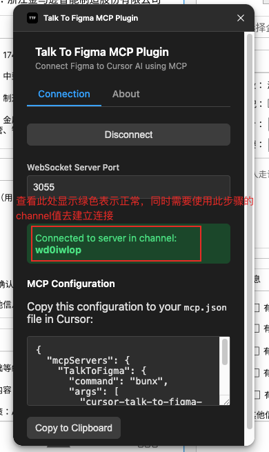
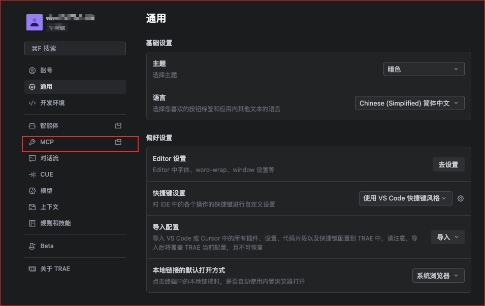
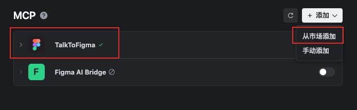
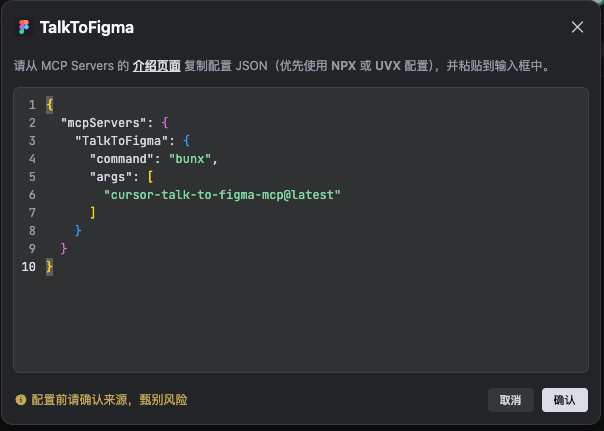
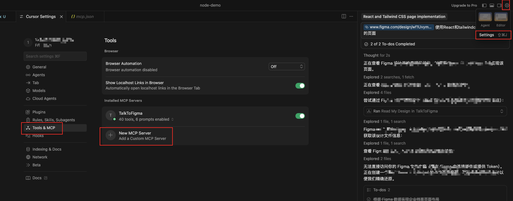
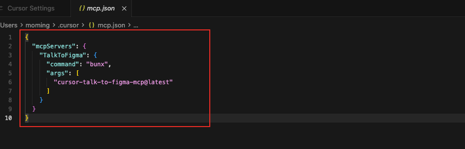
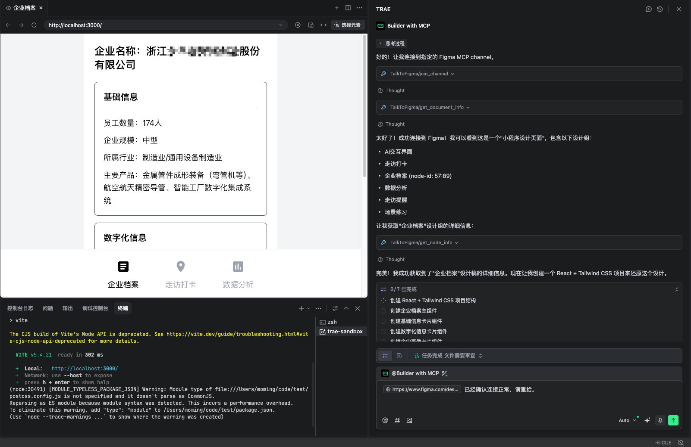

# FigmaMCP

使用FigmaMCP之后，可以借助Cursor、Trea等编辑器内置的AI能力，可以直接传入Figma的设计图链接直接生成React的前端源代码。

## 基础环境安装

### 安装 Figma 桌面端（网页版无法导入开发插件）

官网下载：https://www.figma.com/downloads/

### 安装Bun

```shell
curl -fsSL https://bun.sh/install | bash
```

### 安装并导入 Figma 插件

```shell
npm install -g talk-to-figma-mcp-tool
```

### Figma启动插件




### 安装编辑器的MCP插件

trea：




cursor:




### 链接MCP

```shell
# 发送给AI Chat
连接figma mcp，channel： m6hqgoii
```

## 使用样例

`https://www.figma.com/design/wf1UvymXunJfUYm158dVj0/Untitled?node-id=108-3&t=QrZgc7ChZ7vZjnVY-4` 读取figma的设计稿，生成React页面代码，要求使用tailwindcss。

输出结果：



## 总结

基本上能用工具直接还原出一个大概的内容；但在菜单以及模块的一些局部样式和布局方面，AI可能会理解错，需要人工进行复查矫正；另外在代码抽象逻辑方面，AI目前相对来说默认的方式可能会单个文件直接实现全部内容，需要在提示词或者要求方面添加更多条件会更加精准。